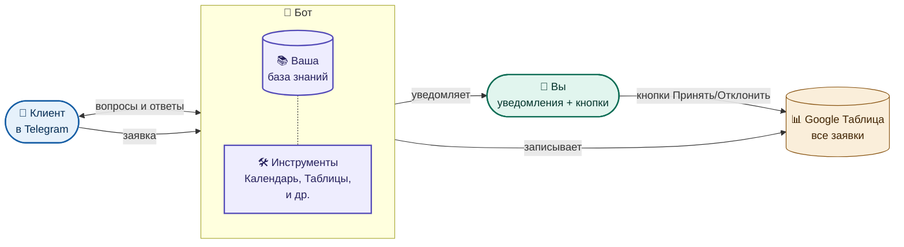
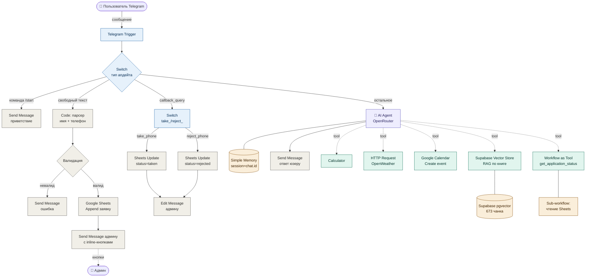

# AI-ассистент в Telegram с RAG, инструментами и приёмником заявок

> Telegram-бот, который сочетает три вещи в одном продукте: разговорный AI с памятью, доступ к внешним сервисам через инструменты, и систему приёма+обработки клиентских заявок с уведомлениями админу.

##  Что происходит на схеме

Бот реагирует на любое сообщение в Telegram и сам решает, что с ним делать. Я заложил в него **три сценария**:

### 1️⃣ Клиент задал вопрос («сколько стоит ваш курс?», «как записаться?», «какие у вас есть программы?»)
Бот ищет ответ в **вашей базе знаний** — PDF, Google Docs, Notion, всё что вы туда загрузите. Отвечает в стиле живого диалога, помнит контекст переписки. Если не находит — честно говорит, что не знает, и зовёт вас.

### 2️⃣ Клиент оставил заявку (написал имя и телефон)
Бот сам понимает, что это контактные данные — даже если клиент написал в свободной форме («Иван 89991234567» или «меня зовут Алексей, мой номер +7 999...»).
- Проверяет, что телефон похож на телефон, а имя — на имя
- Записывает заявку в **Google Таблицу** с пометкой «новая»
- Сразу присылает **вам** уведомление с двумя кнопками: **[Принять]** и **[Отклонить]**
- Вы жмёте кнопку → статус в таблице обновляется автоматически

То есть все заявки попадают в одно место, и вы видите по таблице кто принят, кто отклонён, кто ещё в обработке.

### 3️⃣ Клиент попросил что-то конкретное (создать встречу, посчитать смету, узнать прогноз погоды)
У бота подключены **инструменты**, которыми он пользуется, когда они нужны:
- 📅 Создать событие в вашем Google Календаре по фразе «запиши встречу с клиентом завтра в 14:00»
- 🧮 Посчитать что-то точно (без выдумывания цифр)
- 🌤 Узнать погоду в любом городе
- 📊 Достать статистику из Google Таблиц (например, «сколько заявок пришло сегодня»)

Этот набор расширяется под ваши задачи — можно подключить вашу CRM, базу клиентов, систему оплаты, что угодно.

---

## 🎯 Проблема

Этот АИ ассистент поможет отвечать на вопросы по поводу бизнеса
- Если вам приходили заявки разразнёно: из сайта, телеграма, почты, то бот позволит объединить их все в Телеграме
- Бот не сотрудник - работает круглосуточно, отвечает на 70% вопросов, остальные 30% он отправляет на рассмотрение вам в телеграмм., Бот отвечает за 3-5 секунд.
- Всё вопросы хранятся в форме гугл таблиц

Типичный заказчик такого решения — малый бизнес или эксперт-одиночка, у которого:
- Сотни одинаковых вопросов в Telegram про регламенты/услуги/расписание
- Заявки приходят разрозненно: кто-то в личку, кто-то на почту, кто-то на сайт
- Нет времени отвечать 24/7, но клиенты теряются если не отвечать в первые 5 минут
- База знаний есть (PDF-регламенты, гугл-доки), но никто их не читает

**Что теряет бизнес без автоматизации:**
- В среднем 30-40% лидов не доходят до созвона (медленный ответ)
- Сотрудник тратит ~2 часа в день на повторяющиеся вопросы
- Заявки теряются между мессенджерами и почтой

---

## 🔧 Решение

Telegram-бот на n8n, который закрывает три задачи одной точкой входа:

### 1. Разговорный AI-ассистент с RAG
Отвечает на вопросы по корпоративной базе знаний (PDF, Google Docs, Notion). Использует семантический поиск через Supabase + pgvector — находит релевантные куски документов по смыслу, не по ключевым словам.

### 2. Подключённые внешние сервисы (tools)
- 🌤 Узнать погоду в любом городе
- 📅 Создать событие в Google Calendar по голосовой формулировке («встреча с клиентом завтра в 14:00»)
- 🧮 Точные вычисления (Calculator вместо галлюцинаций модели)
- 📊 Запросить статистику из Google Sheets через sub-workflow

### 3. Приёмник заявок с обработкой админом
Пользователь пишет имя+телефон в свободной форме → бот парсит → валидирует → пишет в Google Sheets → отправляет админу уведомление с inline-кнопками **[Принять] / [Отклонить]**. Нажатие кнопки обновляет статус заявки в Sheets.

### Технический стек
- **n8n** (self-hosted на VPS) — оркестратор
- **OpenRouter** — gateway к LLM (Anthropic Claude / OpenAI GPT)
- **Supabase + pgvector** — vector store для RAG
- **OpenAI text-embedding-3-small** — embeddings (1536 размерность)
- **Telegram Bot API** — интерфейс
- **Google Calendar / Sheets / Drive** — внешние сервисы

### Архитектура

---

## 📊 Результат

Если приобретёте моего бота вы получите следующие:
- Работника, который будет работать кргулосуточно и быстро 3-5 секунд
- Единый источник для принятия заявок
- Админ получает сообщения которые уже прошли проверку и он принимает или отклоняет 
- единый источник для хранения заявок

**Что получает заказчик:**
- 24/7 ответы на вопросы по базе знаний без участия человека
- Все заявки попадают в одно место с понятным статусом
- Админ получает уведомления только по делу, в один клик принимает/отклоняет
- База знаний обновляется добавлением документа в Google Drive — бот сам подхватит при следующей загрузке

**Метрики (ориентир для обещаний клиенту):**
- Время ответа на вопрос: **3-5 секунд** vs «когда менеджер найдёт время»
- Доля автоматизированных ответов: **70-80%** (остальное эскалация)
- Экономия времени админа: **~10 часов в неделю**

---

##  Грабли и инсайты

То, на что я наступил при разработке — и что теперь знаю наперёд.

**Semantic mismatch в RAG.** Векторный поиск ищет по смыслу, а не по логической связи. На общий вопрос «что думаешь об идеях книги?» retrieval ловил мета-страницы (биография автора, оглавление) вместо содержательных глав. Лечится через переформулировку: либо подкручивать description у Vector Store Tool, либо добавлять query rewriting (модель сама переформулирует общий вопрос в конкретный перед поиском).

**Document Loader — это саб-нода.** В архитектуре n8n RAG-pipeline'а Default Data Loader подключается *снизу* к Vector Store, а не *в цепочке после* Google Drive. Неочевидно с первого раза.

**callback_data ограничен 64 байтами.** Кириллицу нельзя. Поэтому в inline-кнопках использовал латинские префиксы `take_` / `reject_` + телефон как ключ для поиска заявки в Sheets. И `Switch starts_with` вместо `is_equal_to`.

**Параллельные ветки от Trigger.** Лог в Sheets идёт параллельной веткой fire-and-forget — не блокирует ответ пользователю. AI Agent отрабатывает на основной.

**Конфликт инстансов n8n.** Если запустить два сервера с одним Telegram-токеном — оба получают getUpdates, ошибка 409. Очевидно когда знаешь, неочевидно когда отлаживаешь.

---

## 💰 Стоимость

[ВЫБРАТЬ ВАРИАНТ — см. ниже]

**Базовая версия** (только AI + RAG + 2-3 tools): **15 000 — 20 000 ₽**
Срок: 5-7 дней

**Полная версия** (как в кейсе: AI + RAG + 5 tools + приёмник заявок): **30 000 — 50 000 ₽**
Срок: 10-14 дней

**С поддержкой и развитием** (retainer): **5 000 — 10 000 ₽/мес**
- Обновление базы знаний
- Добавление новых tools
- Мониторинг и фикс инцидентов

---

## 🔗 Ссылки

- [GitHub: workflow JSON и README](https://github.com/Misha_kopo/n8n-portfolio)
---

## Контакты
Telegram: @Misha_kopo
