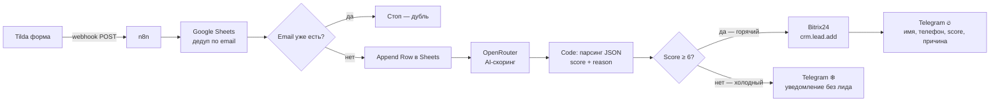

# Case 2 — Tilda Lead Scoring: автоматический приём и скоринг заявок

> Webhook-приёмник для заявок с сайта Tilda: дедупликация, запись в Google Sheets, AI-оценка приоритета через OpenRouter и автоматическое создание лида в Bitrix24 для горячих заявок.

---

## 🎯 Проблема

Типичная ситуация у малого бизнеса: форма на Tilda принимает заявки, но дальше начинается ручная работа.

- Менеджер вручную смотрит каждую заявку и решает, стоит ли звонить
- Одни и те же люди отправляют форму несколько раз — появляются дубли в CRM
- Нет приоритизации: холодный запрос «просто посмотреть» попадает в ту же очередь, что и горячий «нужно срочно, есть бюджет»
- Пока менеджер разбирается — горячий лид остывает

**Что теряет бизнес:**
- Горячие лиды ждут обработки наравне с холодными
- Менеджер тратит 20–30% времени на заявки, которые не конвертируются
- Дубли засоряют CRM и искажают статистику

---

## 🔧 Решение

n8n-workflow, который принимает webhook от Tilda и за секунды делает всё сам:

1. **Дедупликация по email** — проверяет Google Sheets, если такой email уже есть, заявка игнорируется
2. **Запись в Sheets** — новая заявка логируется с именем, телефоном, email, комментарием, датой и статусом
3. **AI-скоринг** — OpenRouter анализирует текст комментария и возвращает оценку 1–10 + причину
4. **Роутинг по приоритету:**
   - Score ≥ 6 → создаётся лид в Bitrix24 через HTTP REST API + алерт в Telegram с оценкой
   - Score < 6 → только уведомление в Telegram без создания лида



---

## 🛠 Технический стек

| Компонент | Роль |
|---|---|
| n8n (self-hosted) | оркестратор |
| Tilda | источник заявок (webhook) |
| Google Sheets | дедупликация + лог заявок |
| OpenRouter | AI-скоринг через LLM |
| Bitrix24 REST API | CRM (через HTTP Request, нативной ноды нет) |
| Telegram Bot API | уведомления менеджеру |

---

## ⚙️ Как это работает изнутри

### Дедупликация
Google Sheets нода `Get Rows` ищет строку с совпадающим email. Важный момент: включён флаг **Always Output Data** — иначе при пустом результате (новый лид) нода ничего не отдаёт дальше и IF не срабатывает. Условие IF: `$json.email is empty` → true означает «такого email нет, лид новый».

### AI-скоринг
HTTP Request к OpenRouter с `temperature: 0` и промптом:
```
Оцени входящую заявку. Ответ дай в формате JSON БЕЗ MARKDOWN:
{"score": число от 1 до 10, "reason": "объясни почему"}
Score 6–10 = конкретный запрос, есть бюджет и срок.
Score 1–5 = расплывчато, без бюджета, без срока.
```
Code-нода парсит ответ через `content.match(/\{[\s\S]*\}/)` — защита от случаев когда модель всё-таки оборачивает ответ в markdown.

### Bitrix24 через HTTP Request
Нативной ноды для Bitrix24 в n8n нет. Работаем напрямую через REST API входящего вебхука:
```
POST https://YOUR_BITRIX24_DOMAIN/rest/1/YOUR_TOKEN/crm.lead.add
```
Поля PHONE и EMAIL передаются как массивы объектов — это особенность Bitrix24 API:
```json
"PHONE": [{"VALUE": "89991234567", "VALUE_TYPE": "WORK"}]
```

---

## 🪤 Грабли

**Always Output Data обязателен в Get Rows.** Без него пустой результат (новый лид) просто не передаётся дальше — IF не запускается и workflow тихо умирает. Включить в настройках ноды.

**PHONE и EMAIL в Bitrix24 — массивы, не строки.** Если передать строку — API примет запрос без ошибки, но поле окажется пустым. Всегда оборачивать в `[{"VALUE": "...", "VALUE_TYPE": "WORK"}]`.

**Модель игнорирует "без markdown".** Даже при явном запрете LLM иногда возвращает ответ в ```json блоке. Поэтому парсинг через regex, а не через `JSON.parse()` напрямую.

**`$json.email` vs `$('Нода').first().json.email`.** Когда данные нужны из ноды, которая не является непосредственным предшественником — обязателен явный референс с `first()`. Без него n8n берёт данные из текущего контекста, который может быть пустым.

**Send Body выключен по умолчанию в HTTP Request.** Если забыть включить — запрос улетает без тела, Bitrix24 возвращает ошибку или создаёт пустой лид.

---

## 📊 Результат

- Время от заявки до уведомления менеджера: **~3 секунды**
- Дубли отсекаются автоматически — CRM остаётся чистой
- Менеджер видит только горячие лиды с готовой оценкой и причиной
- Холодные заявки попадают в Sheets для статистики, не засоряя CRM

---

## 💰 Стоимость под ключ

| Вариант | Цена | Срок |
|---|---|---|
| Базовый (webhook → Sheets → Telegram) | 8 000 — 12 000 ₽ | 3–5 дней |
| С AI-скорингом (как в кейсе) | 15 000 — 25 000 ₽ | 5–7 дней |
| С Bitrix24/AmoCRM + скоринг | 20 000 — 35 000 ₽ | 7–10 дней |
| Поддержка и доработки (retainer) | 5 000 — 10 000 ₽/мес | — |

---

## ⚙️ Настройка

Замени в workflow перед использованием:

| Плейсхолдер | Что подставить |
|---|---|
| `YOUR_BITRIX24_DOMAIN` | домен вашего Bitrix24 (например `b24-abc123.bitrix24.ru`) |
| `YOUR_BITRIX24_WEBHOOK_TOKEN` | токен входящего вебхука из Bitrix24 |
| `YOUR_GOOGLE_SHEET_ID` | ID Google Таблицы для лидов |
| `YOUR_ADMIN_CHAT_ID` | ваш Telegram chat_id |

Подключи credentials в n8n: Google Sheets OAuth2, OpenRouter API, Telegram Bot.

---

## 🔗 Контакты

Telegram: @Misha_kopo
