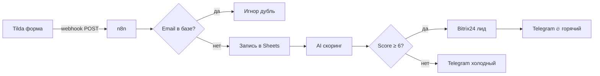

# Case 2 — Tilda Lead Scoring

Автоматически принимает заявки с сайта Tilda, оценивает приоритет через AI 
и передаёт горячие лиды в Bitrix24 с уведомлением в Telegram.

## Как работает

1. Tilda отправляет webhook при заполнении формы
2. Дедупликация по email через Google Sheets — повторные заявки отсекаются
3. Новый лид записывается в Sheets
4. AI (OpenRouter) оценивает текст заявки и возвращает score 1–10 + причину
5. Score ≥ 6 → создаётся лид в Bitrix24 + алерт в Telegram с оценкой
6. Score < 6 → уведомление в Telegram без создания лида

## Стек

- n8n (self-hosted)
- Tilda (webhook)
- Google Sheets (дедупликация + лог)
- OpenRouter (AI-скоринг)
- Bitrix24 (CRM, через HTTP REST API)
- Telegram (уведомления)

## Настройка

Замени в workflow:
- `YOUR_BITRIX24_DOMAIN` — домен вашего Bitrix24
- `YOUR_BITRIX24_WEBHOOK_TOKEN` — токен входящего вебхука
- `YOUR_GOOGLE_SHEET_ID` — ID таблицы лидов
- `YOUR_ADMIN_CHAT_ID` — ваш Telegram chat_id
- Подключи credentials: Google Sheets OAuth2, OpenRouter, Telegram Bot

